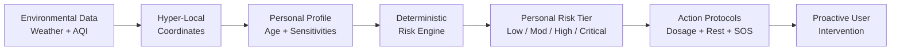

# SwasthyaSathi AI — Personal Health Companion (SIH26181)

[](https://sih.gov.in)
[](#)
[](#)
[](#)

> **Personalized Environmental Health Monitoring & Early-Warning System** built for **Smart India Hackathon 2026, Problem Statement 26181**.

---

## 1. Executive Summary

Standard weather broadcasts report generic metrics (e.g. *"39°C, AQI 185"*) that mean little to the average citizen and fail to prevent climate-induced health crises. 

**SwasthyaSathi AI** translates real-time environmental telemetry (extreme heat waves, toxic particulate smog, humidity surges, and urban inundations) into **personalized health risk levels** (`Low`, `Moderate`, `High`, `Critical`) tailored to an individual's age group, outdoor exertion patterns, and physiological sensitivity flags—delivering concrete preventive protocols before symptoms escalate into medical emergencies.

---

## 2. Core Product Logic Chain



---

## 3. Technology Stack

- **Frontend Framework**: [Next.js 14 (App Router)](https://nextjs.org/) with TypeScript
- **Styling & Design Tokens**: [Tailwind CSS](https://tailwindcss.com/) with a restrained clinical-telemetry palette (`#035657` deep teal, coral alert accent, atmospheric navy)
- **Typography**: *Plus Jakarta Sans* (headlines & metrics) + *Inter* (body & telemetry data)
- **Environmental Telemetry**: Open-Meteo Weather API + Open-Meteo Air Quality API (zero-auth, keyless, high precision for India)
- **Risk Computation Engine**: Pure, deterministic TypeScript function (`lib/riskEngine.ts`)
- **Data Persistence**: Local-first storage (`localStorage`) with clean Supabase Postgres adapter (`lib/supabaseClient.ts`)
- **Geolocation**: Browser Geolocation API with manual Indian city search autocomplete

---

## 4. Route Architecture

| Route | Functionality |
|---|---|
| **`/`** | **Landing Overview**: Hero with 3-profile interactive risk simulator, Problem analysis (Indian hazard scenarios), Solution (6-stage stepper), 6 Features, Innovation breakdown, Real Impact, and Team. |
| **`/dashboard`** | **Interactive Health Companion**: Real-time atmospheric telemetry, computed personal risk card, wearable sensor simulator (running ECG stroke, HRV, SpO2, thermal stress), 12-hour predictive timeline, SwasthyaSathi AI body triage assistant, low-connectivity mode, and one-touch emergency SOS. |
| **`/profile`** | **Personalization & Sensitivities**: Minimal parameters (First name, age bracket, outdoor exposure, sensitivity checkboxes, emergency contact) + 1-click demographic demo presets. |
| **`/privacy`** | **Privacy Architecture**: Data minimization guarantee, local execution explanation, permission-based GPS, and future mobile edge roadmap. |

---

## 5. The Deterministic Risk Engine (`lib/riskEngine.ts`)

In accordance with the hackathon brief, Round 1 avoids black-box hallucinations. It uses an auditable multi-factor formula:

1. **Thermal Stress Index ($1.0 - 4.0$)**: Evaluates ambient temperature against apparent feels-like and wet-bulb humidity thresholds (IMD / NOAA heat categories).
2. **Particulate Strain ($1.0 - 4.0$)**: Evaluates PM2.5 and PM10 against Indian National Air Quality Index (CPCB) breakpoints.
3. **Compound Environmental Multiplier**: Additional penalty when severe heat and high AQI occur simultaneously.
4. **Outdoor Exposure Multiplier**: Indoor office worker ($0.8\times$) vs active outdoor laborer ($1.25\times$).
5. **Biological Vulnerability Escalation**: Age group factors (`60+`, `under18`) and targeted sensitivity multipliers (`heat`, `cardiovascular`, `respiratory`).

```ts
import { computeRisk } from "@/lib/riskEngine";

const result = computeRisk({
  temperatureC: 39,
  feelsLikeC: 44,
  humidityPct: 62,
  aqi: 245,
  ageGroup: "18-40",
  outdoorActivityLevel: "high",
  sensitivities: ["heat"],
});

// Output:
// level: "Critical"
// primaryDriver: "Severe ambient heat (39°C, Feels like 44°C) combined with high particulate load (AQI 245)..."
// recommendations: ["Drink 350-400 mL electrolyte fluid every 30 mins...", ...]
```

---

## 6. Privacy & Ethical Standards

- **Zero Medical Records**: No hospital files, clinical histories, prescription data, or diagnostic codes are ever collected or stored.
- **Local-First Execution**: In this Web MVP, profile parameters never leave the user's browser client.
- **Honest Copy**: The Emergency SOS flow explicitly represents itself as a hackathon simulation with live coordinates, without falsely claiming to dial 112/911.

---

## 7. Getting Started Locally

### Prerequisites
- Node.js 18+ or 20+
- npm or pnpm

### Installation
```bash
# 1. Clone the repository
git clone https://github.com/your-team/swasthyasathi-ai.git
cd swasthyasathi-ai

# 2. Install dependencies
npm install

# 3. Start development server
npm run dev
```

Open [http://localhost:3000](http://localhost:3000) in your browser.

---

## 8. Deployment to Vercel

The project is pre-configured for instant zero-configuration deployment to Vercel:

1. Push the repository to GitHub.
2. Import the project into [Vercel](https://vercel.com).
3. Framework preset will automatically detect **Next.js**.
4. Click **Deploy**. No mandatory environment variables are required for Round 1 demonstration.

---

## 9. Future Roadmap (Hardware Track / Native Mobile)

- **Phase A**: React Native / Native Android client with background geofencing.
- **Phase B**: Bluetooth Low Energy (BLE 5.2) wearable sensor band integration (real-time resting pulse, SpO2, skin temperature).
- **Phase C**: Quantized on-device edge ML models (TensorFlow Lite) for syncope and heat-stroke prediction during network blackouts.

---

© 2026 SwasthyaSathi AI Team. Built for Smart India Hackathon 2026 (Problem Statement 26181).
